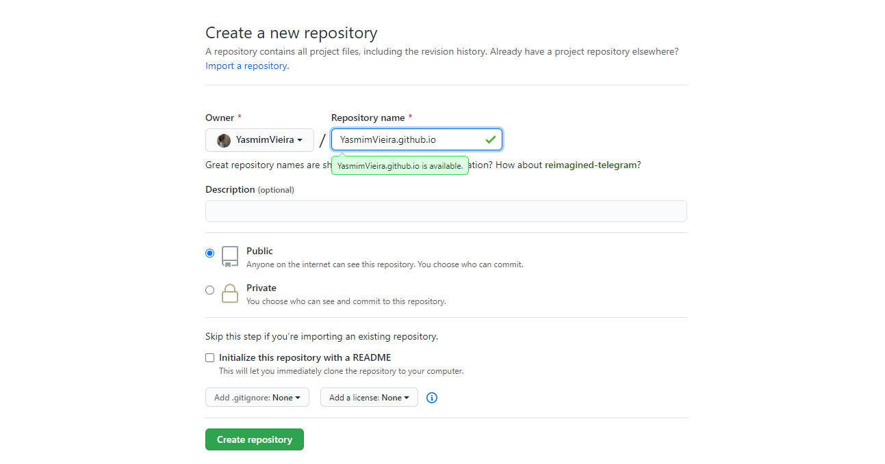

# Como hospedar um site no github pages?

Esse mini tutorial tem como intituito explicar de forma simples e prática como você hospedar um site no github.

## O que é github pages?

> O Github é um sistemas de genrenciamento de projetos e versionamento de código,
> ele é muito utilizado por diversas empresas, grandes e pequenas, para podeream 
> trabalhar em cima de um projeto. 
> Por tanto, o Github é uma plataforma muito robusta e nos da várias funcionalidades e 
> uma delas é a hospedagem de sites estáticos.

- Mas como assim sites estáticos? 

> Basicamente são sites que não necessitam de um banco de dados, por exemplo,
> para a sua funcionalidade. Utilizando geralmente tecnologias como: HTML, CSS e Javascript.
> Se você tentasse hospedar um site no Github pages utilizando PHP, Java e linguagens que
> trabalham mais na parte do servidor, não teria sucesso.

<div align="center">
    
</div>

- Quando usar? 

> Você pode usar quando for criar um portfolio on-line, uma documentação,
> alguma postagem estática e apenas.

## Vamos para prática!

- 1º passo: Crie um repositório no github com o nome do seu usário + github.io:

<div align="center">
    
</div>

Assim o Github já entenderá que esse repósitorio será hospedado.

- 2º passo: Clone esse repositório no projeto que está fazendo;
    - Obs: Comando para fazer através do terminal:

```sh
 $ git clone https://github.com/username/username.github.io
```

- 3º passo: adicione os arquivos do projeto para posteriormente poder commitar:
```sh
 $ git add .
```

- 4º passo: agora commite seus arquivos para poder hospedar:
```sh
 $ git commit -m "escreva uma mensagem"
```

- 5º passo: parte final agora, vamos apenas levar nosso projeto até o github e assim vamos conseguir publicar:
```sh
 $ git push origin master
```

## Resultado

- Após esses passos, assim que você der um git push ele já irá publicar seu projeto! É só procurar no google o endereço como "username.github.io"


## Referências

[GithubPages-documentation](https://pages.github.com/)

Autora
----

Desenvolvido por [Yasmim Barbosa Vieira](https://www.linkedin.com/in/yasmim-barbosa/) - Desenvolvedora Front-end